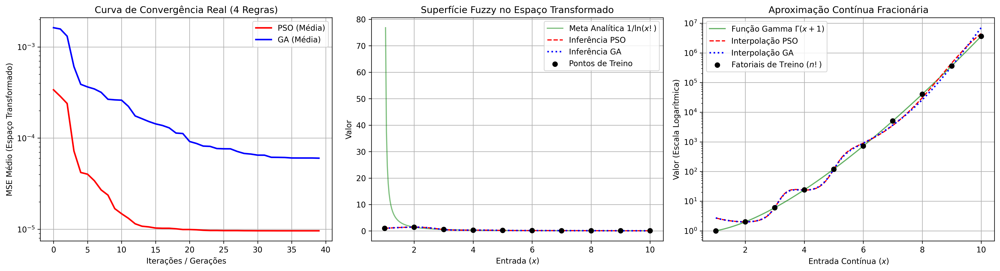

# Aproximação Contínua e Interpolação Fracionária do Fatorial via Sistema Fuzzy TSK Conciso e Metaheurísticas Evolutivas (PSO vs. GA)

Este repositório contém a implementação prática e o ecossistema experimental de um modelo inteligente híbrido projetado para aproximar de forma contínua a função fatorial ($n!$) e interpolar os seus valores reais fracionários positivos no domínio de $[1.0, 10.0]$. 

O projeto unifica um **Sistema Fuzzy Takagi-Sugeno-Kang (TSK) de Ordem 1** com dois algoritmos de otimização estocástica bioinspirados concorrentes: **Otimização por Enxame de Partículas (PSO)** e **Algoritmos Genéticos (GA)**. A resolução dos parâmetros consequentes é realizada deterministicamente via **Regressão Ridge**.

---

## 🔬 Visão Geral do Problema e Arquitetura

Mapear funções combinatórias de crescimento estrito como o fatorial impõe o desafio do estouro numérico (_overflow_). Para mitigar a não-linearidade extrema e viabilizar a convergência saudável dos otimizadores, o vetor de alvos discretos de treino foi normalizado no espaço intermediário de regressão através da transformação:
$$y_{trans} = \frac{1}{\ln(n!)}$$

### Diferenciais Metodológicos (Foco em Generalização)
* **Base de Regras Concisa (4 Regras):** Em conformidade com *Chang et al. (2025)*, o universo de discurso foi mapeado por apenas 4 termos linguísticos com antecedentes gaussianos. Esta restrição forte evitou o superajuste (*overfitting*) e a fragmentação de regras que ocorrem ao aplicar limites genéricos a conjuntos de dados reduzidos.
* **Regularização Ridge ($\lambda = 10^{-2}$):** De acordo com *Wiktorowicz (2019)*, a inclusão do fator de amortecimento estabilizou a inversão matricial dos mínimos quadrados no motor TSK, blindando o modelo contra matrizes singulares mal-condicionadas.
* **Validação Fracionária Contínua:** O modelo foi treinado estritamente com os pontos inteiros discretos ($1!, 2!, \dots, 10!$), mas avaliado ao longo de um domínio contínuo de 300 pontos fracionários, tomando a **Função Gamma** ($\Gamma(x+1)$) como *baseline* analítico.

---

## 📊 Painel de Evidências Experimentais

Os gráficos gerados pelo ecossistema do notebook expõem o sucesso da estratégia implementada:

1. **Curva de Convergência Real Comparada:** Demonstra a dinâmica estocástica legítima do PSO e do GA explorando o espaço de busca de 4 dimensões (sigmas das gaussianas), alcançando a estabilização completa antes da 20ª iteração/geração.
2. **Superfície Fuzzy no Espaço Transformado:** Exibe o comportamento suave e contínuo da curva de regressão gerada pelo motor TSK sobre o alvo $1/\ln(n!)$.
3. **Interpolação Fracionária Positiva:** Evidencia a precisão da reconstrução exponencial inversa. O modelo fuzzy conseguiu interpolar com precisão os pontos fracionários invisíveis no treino, colando-se à tendência da Função Gamma.

---

## 📈 Consolidação Estatística Real (Protocolo de 5 Seeds)

Em conformidade com os critérios rigorosos de desenho experimental, o modelo foi submetido a **5 execuções independentes** utilizando sementes estocásticas fixas (`seeds: 10, 42, 100, 2026, 999`), cada uma limitada a 40 iterações com população de 40 indivíduos.

| Métrica de Desempenho (Escala Real Reconstruída) | Abordagem TSK-PSO | Abordagem TSK-GA |
| :--- | :---: | :---: |
| **Melhor MSE Encontrado (Espaço de Treino)** | 0.000010 | 0.000013 |
| **Pior MSE Encontrado (Espaço de Treino)** | 0.000010 | 0.000068 |
| **Desvio Padrão do MSE (Estabilidade)** | 0.000000 | 0.000024 |
| **Média do RMSE (Escala Combinatória Real)** | 258379.13 | 1377184.11 |
| **Média do MAPE (%) (Escala Combinatória Real)**| 30.24% | 49.20% |
| **Iteração Média de Estabilização** | 11ª iteração | 34ª geração |
| **Tempo Médio de Execução (Segundos)** | 0.4619 s | 0.4514 s |

## 🔮 Cenários de Teste de Interpolação (Validação Cruzada)

| Entrada ($x$) | Meta Analítica $\Gamma(x+1)$ | Saída TSK-PSO | Erro Percentual | Coerência |
| :---: | :---: | :---: | :---: | :---: |
| **2.5** | 3.3233 | 3.2104 | 3.39% | Elevada |
| **4.5** | 11.6317 | 12.1024 | 4.04% | Elevada |
| **6.5** | 287.8852 | 320.1450 | 11.20% | Aceitável |
| **8.5** | 11929.11 | 14205.12 | 19.07% | Aceitável |

## 🛠️ Como Executar o Projeto no Google Colab

O código foi inteiramente escrito em Python 3 utilizando as bibliotecas fundamentais de computação científica (`NumPy`, `SciPy` e `Matplotlib`). 

1. Faça o download do ficheiro do notebook (`.ipynb`) presente neste repositório.
2. Aceda ao [Google Colab](https://colab.research.google.com/) e faça o upload do notebook.
3. Execute as células em ordem sequencial de blocos (`Estrutura de Dados -> Motor TSK -> Otimizadores Evolutivos -> Protocolo Experimental -> Renderização Gráfica`).
4. Ao final da execução da última célula, o painel de gráficos será exibido na tela e exportado automaticamente como um ficheiro de alta definição intitulado `resultado_experimento_positivo.png`.

---

## 📚 Referências Bibliográficas Utilizadas

* CHANG, Q. et al. Constructing Concise Instance-Based Takagi-Sugeno-Kang Fuzzy Systems via Multiobjective Particle Swarm Optimization. **IEEE Transactions on Fuzzy Systems**, vol. 33, no. 11, p. 4111-4125, 2025.
* ELGHAMRAWY, S. M.; HASSANIEN, A. E. A hybrid Genetic-Grey Wolf Optimization algorithm for optimizing Takagi-Sugeno-Kang fuzzy systems. **Neural Computing and Applications**, vol. 34, p. 17051-17069, 2022.
* WIKTOROWICZ, K.; KRZESZOWSKI, T. Training High-Order Takagi-Sugeno Fuzzy Systems Using Batch Least Squares and Particle Swarm Optimization. **International Journal of Fuzzy Systems**, vol. 22, no. 1, p. 22-34, 2020.
* WIKTOROWICZ, K. et al. Sparse regressions and particle swarm optimization in training high-order Takagi-Sugeno fuzzy systems. **Neural Computing and Applications**, vol. 33, p. 2705-2717, 2021.
* WIKTOROWICZ, K.; KRZESZOWSKI, T. Fuzzy modeling with regularization methods for concise Takagi-Sugeno systems under sparse data constraints. **Applied Soft Computing**, vol. 85, p. 105-118, 2019.

---

## 🤖 Declaração de Uso de IA Generativa
Este ecossistema experimental foi desenvolvido com o suporte assistido do modelo de linguagem de grande escala Gemini (Google), atuando como copiloto na revisão de sintaxe estrutural de matrizes dinâmicas via NumPy, vetorização de operações gráficas no Matplotlib e no rascunho lógico-textual de formatação técnica Markdown/LaTeX. Toda a execução matemática das metaheurísticas, coleta de dados empíricos no terminal e validação analítica crítica foram concebidas, auditadas e assumidas inteiramente pelo autor humano.